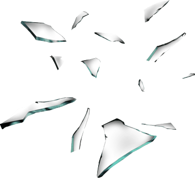

<h1>
  
  Shards
</h1>

> ### ETS tables on steroids!
> Sharding for ETS tables out-of-box.


[](https://codecov.io/gh/cabol/shards/branch/master/graphs/badge.svg)
[](https://hex.pm/packages/shards)
[](https://hexdocs.pm/shards)
[](LICENSE)

Why might we need **Sharding/Partitioning** for the ETS tables? The main reason
is to keep the lock contention under control enabling ETS tables to scale out
and support higher levels of concurrency without lock issues; specially
write-locks, which most of the cases might cause significant performance
degradation.

Therefore, one of the most common and proven strategies to deal with these
problems is [Sharding][sharding] or [Partitioning][partitioning]; the principle
is pretty similar to [DHTs][dht].

This is where [shards][shards] comes in. [Shards][shards] is an Erlang/Elixir
library fully compatible with the [ETS API][ets_api], but it implements sharding
or partitioning on top of the ETS tables, completely transparent and out-of-box.

See the **[getting started][getting_started]** guide
and the **[online documentation](https://hexdocs.pm/shards/)**.

[ets_api]: http://erlang.org/doc/man/ets.html
[sharding]: https://en.wikipedia.org/wiki/Shard_(database_architecture)
[partitioning]: https://en.wikipedia.org/wiki/Partition_(database)
[dht]: https://en.wikipedia.org/wiki/Distributed_hash_table
[shards]: https://hexdocs.pm/shards/shards.html
[getting_started]: guides/getting-started.md

## Installation

### Erlang

In your `rebar.config`:

```erlang
{deps, [
  {shards, "~> 1.0"}
]}.
```

### Elixir

In your `mix.exs`:

```elixir
def deps do
  [{:shards, "~> 1.0"}]
end
```

> For more information and examples, see the [getting started][getting_started]
  guide.

## Important links

  * [Documentation](https://hexdocs.pm/shards) - Hex Docs.

  * [Blog Post](http://cabol.github.io/posts/2016/04/14/sharding-support-for-ets.html) -
    Transparent and out-of-box sharding support for ETS tables in Erlang/Elixir.

  * Projects using **shards**:
    * [shards_dist](https://github.com/cabol/shards_dist) - Distributed version
      of `shards`. It was moved to a separate repo since `v1.0.0`.
    * [ExShards](https://github.com/cabol/ex_shards) – Elixir wrapper for
      `shards`; with extra and nicer functions.
    * [Nebulex](https://github.com/cabol/nebulex) – Distributed Caching
      framework for Elixir.
    * [KVX](https://github.com/cabol/kvx) – Simple Elixir in-memory Key/Value
      Store using `shards` (default adapter).
    * [Cacherl](https://github.com/ferigis/cacherl) Distributed Cache
      using `shards`.

## Testing

```
$ make test
```

You can find tests results in `_build/test/logs`, and coverage in
`_build/test/cover`.

> **NOTE:** `shards` comes with a helper `Makefile`, but it is just a simple
  wrapper on top of `rebar3`, therefore, you can do everything using `rebar3`
  directly as well (e.g.: `rebar3 do ct, cover`).

## Generating Edoc

```
$ make docs
```

> **NOTE:** Once you run the previous command, you will find the generated HTML
  documentation within `doc` folder; open `doc/index.html`.

## Contributing

Contributions to **shards** are very welcome and appreciated!

Use the [issue tracker](https://github.com/cabol/shards/issues) for bug reports
or feature requests. Open a [pull request](https://github.com/cabol/shards/pulls)
when you are ready to contribute.

When submitting a pull request you should not update the [CHANGELOG.md](CHANGELOG.md),
and also make sure you test your changes thoroughly, include unit tests
alongside new or changed code.

Before to submit a PR it is highly recommended to run `make check` before and
ensure all checks run successfully.

## Copyright and License

Copyright (c) 2016 Carlos Andres Bolaños R.A.

**Shards** source code is licensed under the [MIT License](LICENSE).
