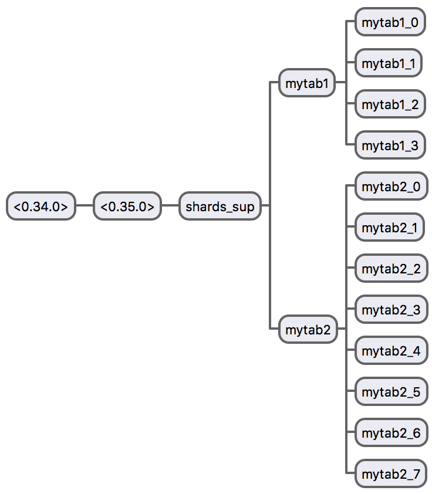
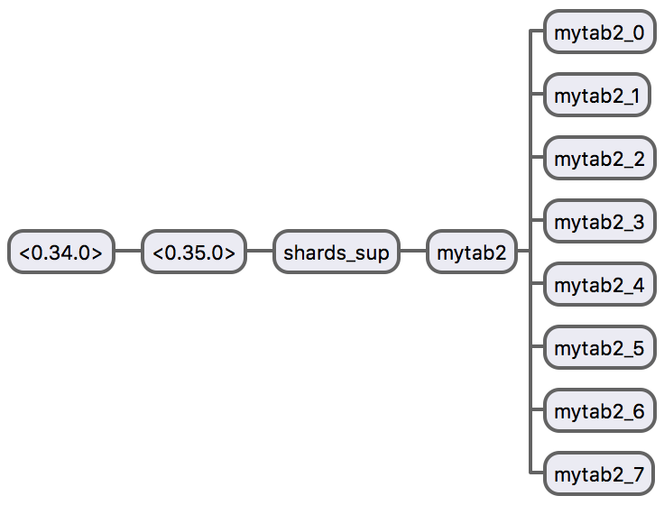

# Shards

ETS tables on steroids!

**Shards** is a very good, and probably the **simplest** option to scale-out ETS tables.

**Shards** also has an [Elixir wrapper](https://github.com/cabol/exshards)!!.


## Introduction

**Shards** is a layer on top of ETS tables in order to enable Sharding support – totally transparent.

Why we might need Sharding on ETS tables? Well, the main reason is to scale-out ETS tables when they become
too large and/or to support high levels of concurrency – these things bring with them some issues like locks,
performance, etc. Therefore, one of the most common and proven strategies to deal with these problems is
[Sharding/Partitioning](https://en.wikipedia.org/wiki/Partition_(database)) – the principle is pretty similar
to [DHTs](https://en.wikipedia.org/wiki/Distributed_hash_table).

Here is where **Shards** comes in. **Shards** makes extremely easy achieve all this, with **zero** effort.
It provides an API compatible with [ETS](http://erlang.org/doc/man/ets.html) – with few exceptions.
You can find the list of compatible ETS functions that **Shards** provides [HERE](https://github.com/cabol/shards/issues/1).

### Related Projects

* [ErlBus](https://github.com/cabol/erlbus) uses `shards` to scale-out **Topics/Pids** table(s),
  which can be too large and with high concurrency level.


## Build

    $ git clone https://github.com/cabol/shards.git
    $ cd shards
    $ make


## Getting Started!

Start an Erlang console with `shards` running:

    $ make shell

Once into the Erlang console:

```erlang
% let's create a table, such as you would create it with ETS
> shards:new(mytab1, [], 5).
{mytab1,{shards_local,set,5}}
```

As you can see, the `shards:new/2,3` function returns a tuple of two elements: `{mytab1,{shards_local,set,5}}`.
The first element is the name of the created table (`mytab1`), and the second one is the
[State](./src/shards_local.erl#L152) (`{shards_local,set,5}`).
We'll talk about the **State** later, and see how it can be used.

Let's continue:

```erlang
% create another one with default pool size (which is 2)
> shards:new(mytab2, []).   
{mytab2,{shards_local,set,2}}

% now open the observer so you can see what happened
> observer:start().
ok
```

You will see something like this:

<p align="center"><a href="#">

</a></p>

This is the process tree of `shards` application. When you create a new "table", what happens behind
is: `shards` creates a supervision tree dedicated only to that group of shards that will represent
your logical table in multiple physical ETS tables, and everything is handled auto-magically by `shards`,
you only have to use the API like if you were working with a common ETS table.

Now let's execute some write/read operations against the created `shards`:

```erlang
% inserting some objects
> shards:insert(mytab1, [{k1, 1}, {k2, 2}, {k3, 3}]).
true

% let's check those objects
> shards:lookup(mytab1, k1).
[{k1,1}]
> shards:lookup(mytab1, k2).
[{k2,2}]
> shards:lookup(mytab1, k3).
[{k3,3}]
> shards:lookup(mytab1, k4).
[]

% delete an object and then check
> shards:delete(mytab1, k3).
true
> shards:lookup(mytab1, k3).
[]

% now let's find all stored objects using select
> MatchSpec = ets:fun2ms(fun({K, V}) -> {K, V} end).
[{{'$1','$2'},[],[{{'$1','$2'}}]}]
> shards:select(mytab1, MatchSpec).
[{k1,1},{k2,2}]
```

As you may have noticed, it's extremely easy, it's like use **ETS**, but instead to use
`ets` module replace it by `shards` module, remember, almost all ETS functions are
implemented by shards.

**Shards** behaves in elastic way, as you saw, more shards can be added dynamically
and also can be removed. E.g.:

```erlang
> shards:delete(mytab1).
true

> observer:start().
ok
```

See how `shards` gets shrinks:

<p align="center"><a href="#">

</a></p>

Extremely simple isn't?


## Using shards_local directly

The module `shards` is a wrapper on top of two main modules:

 * `shards_local`: Implements Sharding on top of ETS tables, but locally (on a single Erlang node).
 * `shards_dist`: Implements Sharding but across multiple distributed Erlang nodes, which must
   run `shards` locally, since `shards_dist` uses shards_local` internally. We'll cover
   the distributed part later.

When you use `shards` on top of `shards_local`, a call to the control ETS table holded by `shards_owner_sup`
must be done, in order to recover the [State](./src/shards_local.erl#L152), mentioned previously.
Most of the `shards_local` functions receives the **State** as parameter, so it must be fetched before
to call it. You can check how `shards` module is implemented [HERE](./src/shards.erl).

If any microsecond matters to you, you can skip the call to the control ETS table by calling
`shards_local` directly. Now the question is: how to get the **State**? Well, it's extremely
easy, you can get the `state` when you call `shards:new/2,3` by first time, or you can call
`shards:state/1` at any time you want, and then it might be store it within the calling process,
or wherever you want.

Most of the cases this is not necessary, `shards` wrapper is more than enough, it adds only a
few microseconds of latency. **Shards** gives you the flexibility to do it,  but it's your call!


## Distributed Shards

Under continuous development. Coming soon!


## Running Tests

    $ make tests


## Building Edoc

    $ make edoc

> **Note:** Once you run previous command, a new folder `edoc` is created, and you'll have a pretty nice HTML documentation.


## Elixir Wrapper

**Shards** also has an Elixir wrapper, check [HERE](https://github.com/cabol/exshards).


## Copyright and License

Copyright (c) 2016 Carlos Andres Bolaños R.A.

**Shards** source code is licensed under the [MIT License](LICENSE.md).
